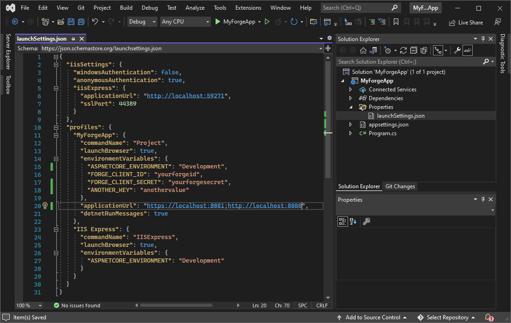

Now that we have a basic ASP.NET application setup, let's try it out!

In order to be able to run our app, we need to provide a "launch configuration" for it,
specifying things such as the environment variables, and the address and port the server should
be listening on. Open the `launchSettings.json` file in the `Properties` folder, add the
`FORGE_CLIENT_ID` and `FORGE_CLIENT_SECRET` environment variables with your Forge app credentials
(and optionally the `FORGE_BUCKET` variable if you already have a bucket you want to use),
and set the `applicationUrl` to `https://localhost:8081;http://localhost:8080`.

With your new launch settings, you can now start the application (for example, using
the _Debug_ > _Start Debugging_ menu item, or by pressing `F5`). Visual Studio will automatically
open the [https://localhost:8081](https://localhost:8081) URL in your browser. You should get
a 404 response because we haven't implemented any server logic yet. That's going to be the goal
of the next step.

:::info
When starting the application for the first time you may be prompted to trust the self-signed
SSL certificate generated by ASP.NET Core. This is expected, and you can accept this prompt.
:::
