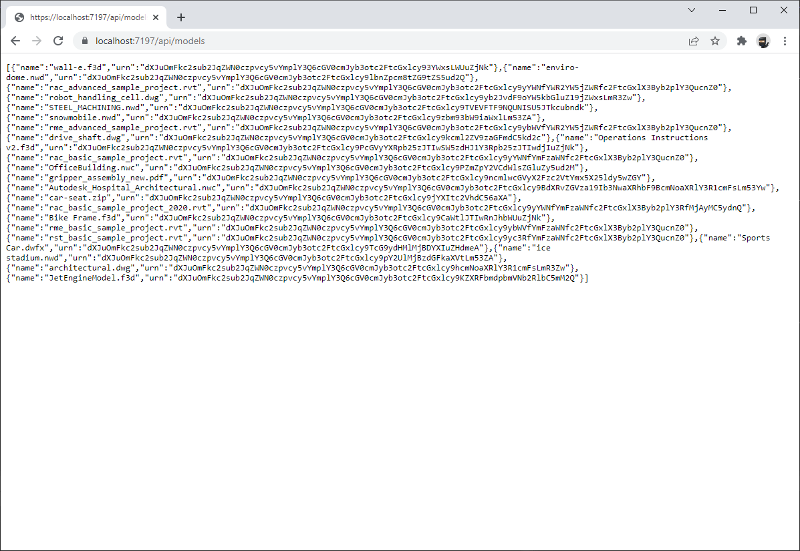

Time to test our improved server application. This time, apart from setting the Forge application
credentials, you can also include the name of the Data Management bucket you want to use via
the optional `FORGE_BUCKET` environment variable.

:::info
If the bucket name is _not_ provided, the `ForgeService` class will generate one by appending `-basic-app`
to your Forge client ID.
:::

:::caution
Note that the Data Management service requires bucket names to be **globally unique**,
and attempts to create a bucket with an already used name will fail with `409 Conflict`.
See the [documentation](https://forge.autodesk.com/en/docs/data/v2/reference/http/buckets-POST)
for more details.
:::

When you start the application and navigate to [https://localhost:7197/api/models](https://localhost:7197/api/models),
the server should respond with a JSON list with the names and URNs of all objects
available in your Data Management bucket.

:::info
If you are just getting started, you may get a JSON response with an empty array (`[]`)
which is expected. In the screenshot below we can already see a couple of files that were
uploaded to our bucket in the past.
:::
