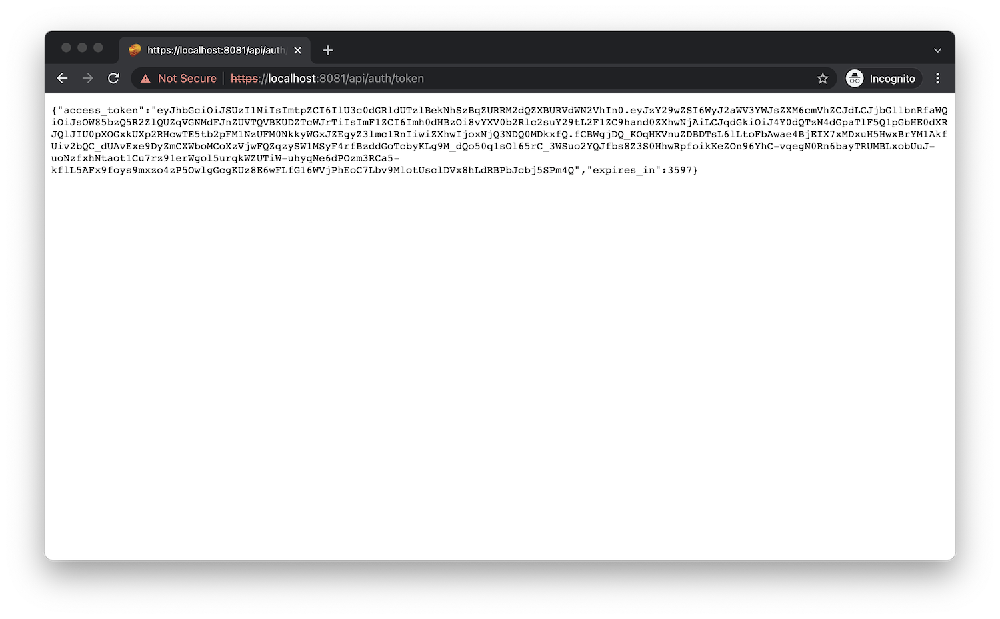

Let's see if our new server endpoint works. Try setting your own Forge client ID and client secret
as the `FORGE_CLIENT_ID` and `FORGE_CLIENT_SECRET` environment variables, and run the application:

```bash
export FORGE_CLIENT_ID=your-own-forge-client-id
export FORGE_CLIENT_SECRET=your-own-forge-client-secret
dotnet run
```

If the server starts successfully and you navigate to [https://localhost:8081/api/auth/token](https://localhost:8081/api/auth/token)
in the browser, the server should respond with a JSON object containing the access token data.


